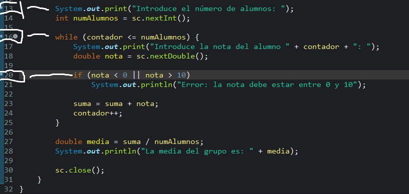
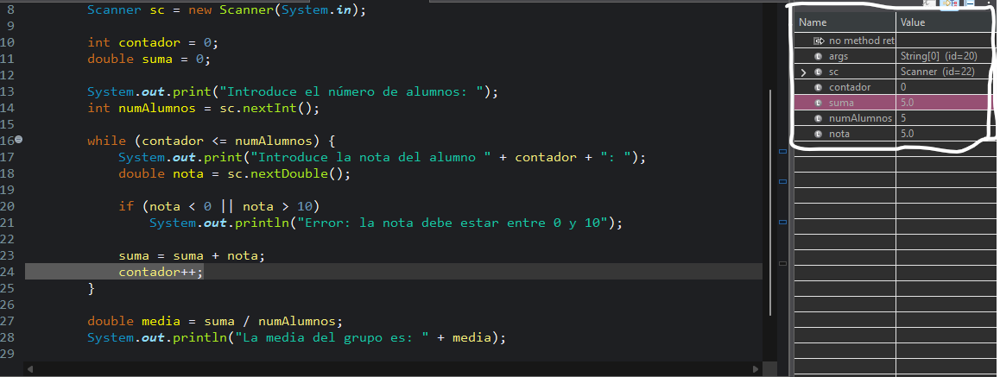
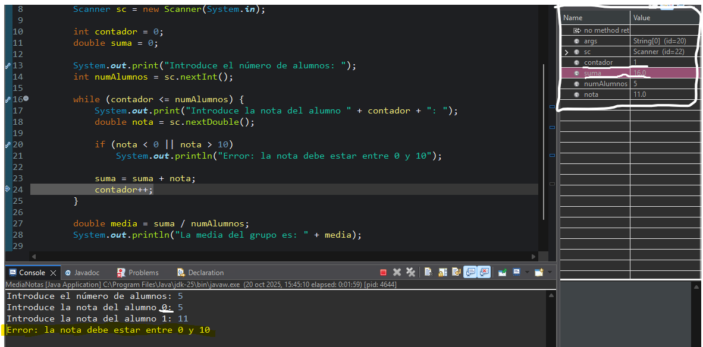
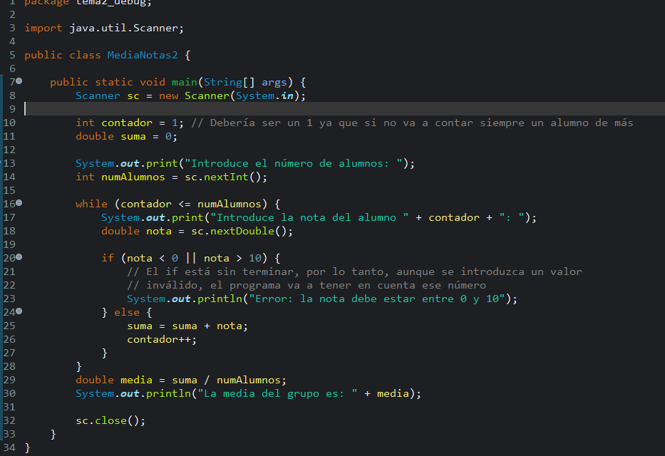

# DAM2526_ED_P4_Practica_Depuracion
## Práctica de Depuración de código en Eclipse

En este ejericio se nos entrega el siguiente código:  

Para este ejercicio se nos pide encontrar los errores de esté mediante la depuración:

**1. Primero debemos colocar nuestros breakpoints para la depuración**

**2. Luego debemos ver cuales son nuestras variables durante el bucle**

**3. Ahora averiguamos cuales son los problemas que sufre el código**

Como podemos observar, el contador no es correcto ya que empieza en el cero y debería empezar en el uno ya que si no siempre se contará a un estudiante de más. Esto también provoca que la media sea incorrecta. 

El otro problema es que el if está incompleto, provocando que salte un mensaje de error, pero aún así el programa sume la nota a la variable "suma".

He aquí una imagen con el código arreglado:

Ahora podemos observar que el contador empieza en uno, el if si se coloca un valor que no este entre 0 y 10, salta un mensaje de error y te vueleve a pedir un número que se encuentre en ese intervalo y la media ahora sí es correcta.
