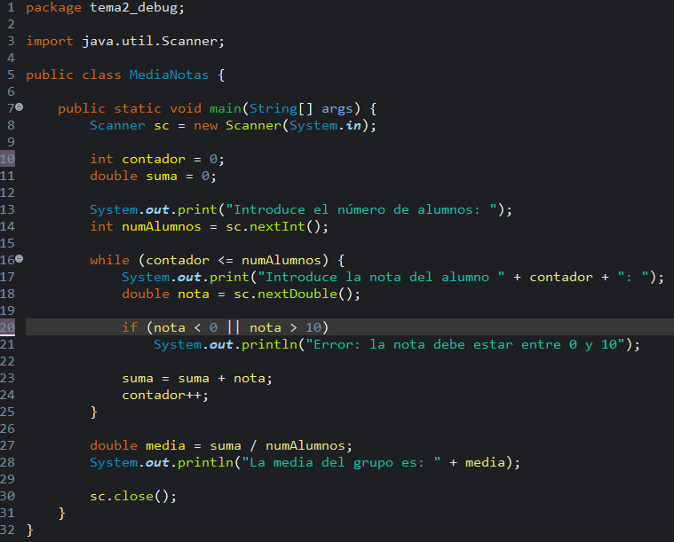

# DAM2526_ED_P4_Practica_Depuracion
## Práctica de Depuración de código en Eclipse

En este ejericio se nos entrega el siguiente código:  

Para este ejercicio se nos pide encontrar los errores de esté mediante la depuración:

1. Para nuestro primer error, me di cuenta que la variable "contador" empezaba en cero:

